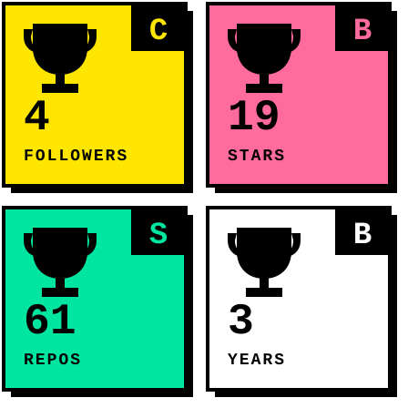

 

 

## ▓▓ NOW

> ### 🔭 BUILDING → [**MIMA**](https://mimaht.com)
> Shipping fullstack products for Haiti and beyond. Fast, bold, no fluff.

 

## ▓▓ STACK

  

 

## ▓▓ FEATURED

 

## ▓▓ STATS

  

  

 

## ▓▓ ACTIVITY

 

## ▓▓ TROPHIES

 

## ▓▓ COMMUNITY

 

## ▓▓ CONTACT

 

  

